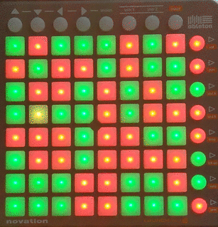
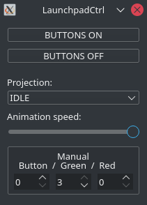

# LaunchpadCtrl

Relaxing animations and sound visualization on the Launchpad S.



One of the animations implemented is mic sound visualization.
Sound is captured from default microphone and converted to sound level value.
LED rows are enabled according to the sound level. YouTube videos below.

[](https://www.youtube.com/watch?v=xT6X5TINXxA)

Animations:

[](https://www.youtube.com/watch?v=Ujcrv2wp1KI)

# Dependencies

* Device: Novation Launchpad S
* OS: Linux (snd_seq_midi kernel module)
* Libraries: Qt Multimedia, ALSA

# Build
Make file generate
```shell
qmake
```
Build executable
```shell
make -j4
```

# Application view


